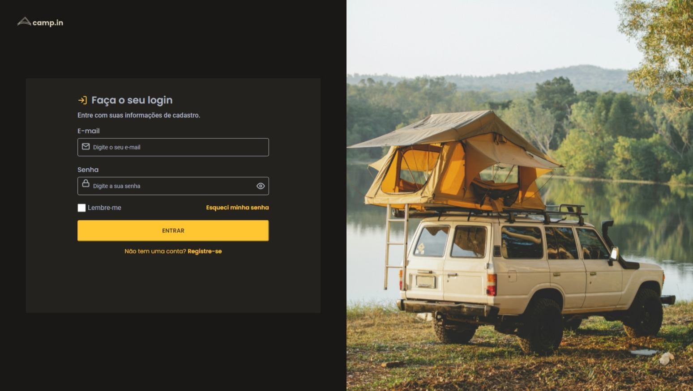

# Loggin Form CSS

This is one of Rocketseat's challenges.

## Tech Stack

### Figma

https://www.figma.com/file/SX8XFyC5fAY09ai8Oykz0T/DD-%2F-Login-Form---CSS/duplicate

## Preview

Vercel link https://desafios-rocketseat-1b87.vercel.app/

## Author

- [David Nunes](https://www.github.com/Dnuns)
