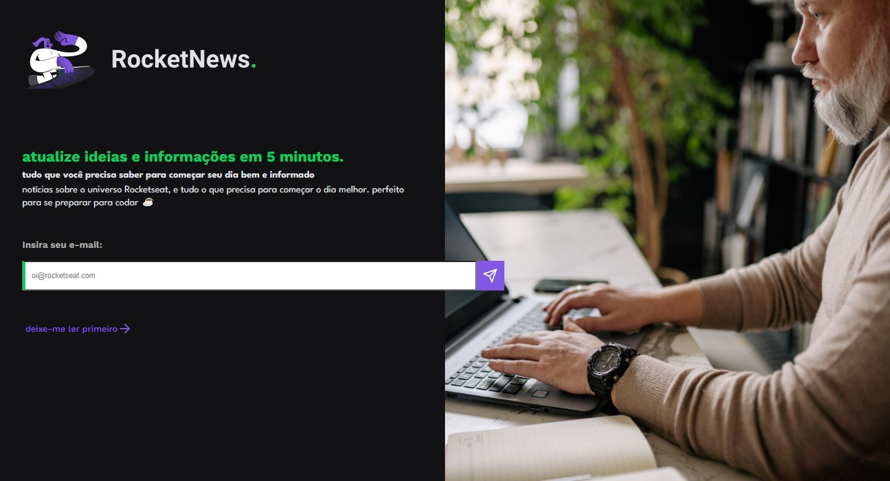

# RocketNews

This is one of Rocketseat's challenges.

## Tech Stack

### Figma

https://www.figma.com/file/OVTHLjc2hi3MSQiYm9BplU/DD-%2F-RocketNews/duplicate

## Preview

Screen resolution (1440x780)

Added alert function to show the inserted email

## Author

- [David Nunes](https://www.github.com/Dnuns)
