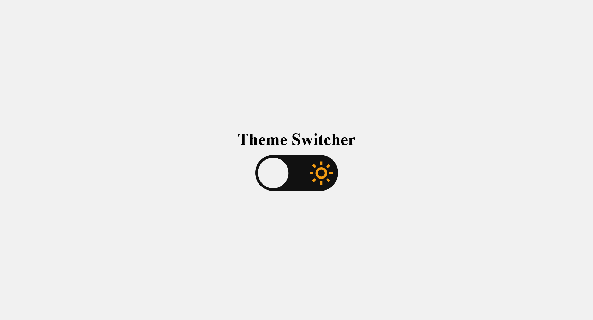
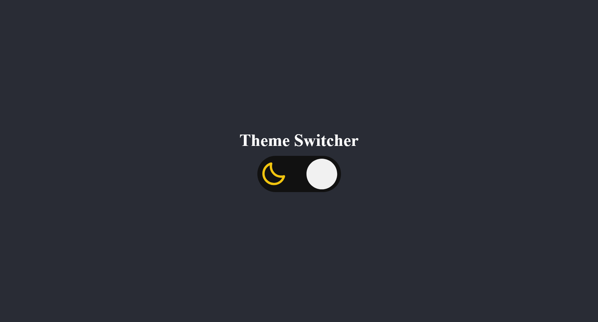

# Theme Switcher

This is one of Rocketseat's challenges.

## Tech Stack

### Figma

https://www.figma.com/file/yJ0kcX1684XPoyJnUf1K6J/DD-Theme-Switcher/duplicate

### Netlify link
https://beamish-peony-81529b.netlify.app

## Preview

## Author

- [David Nunes](https://www.github.com/Dnuns)
